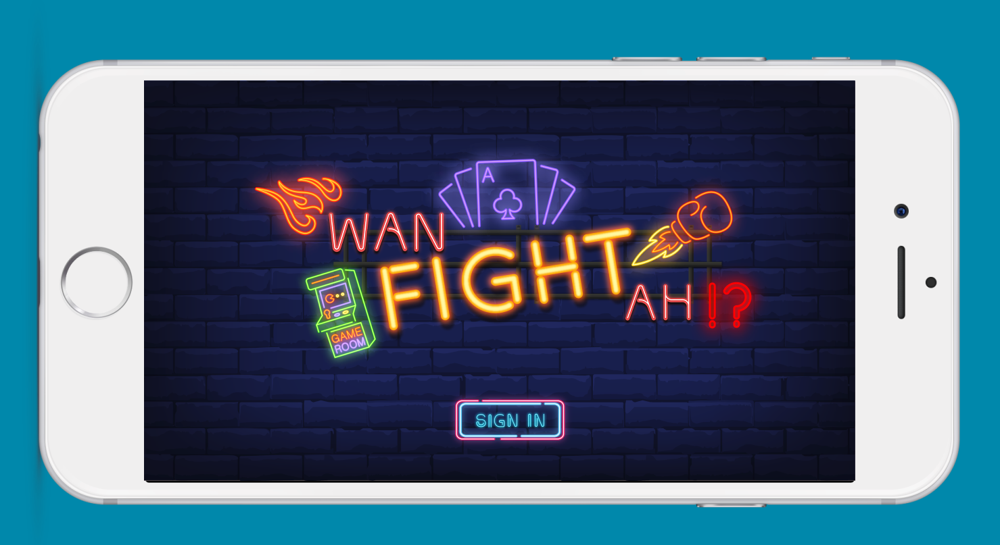
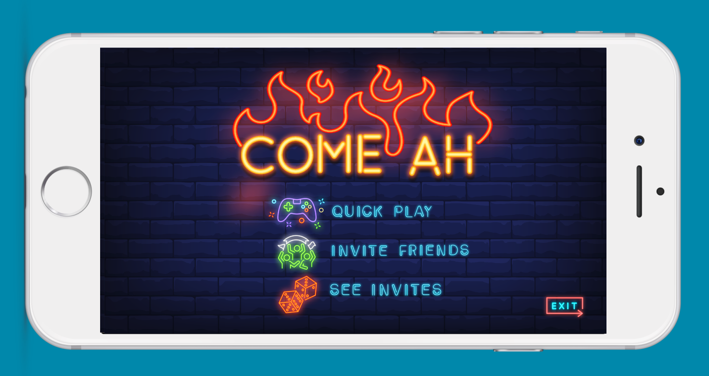
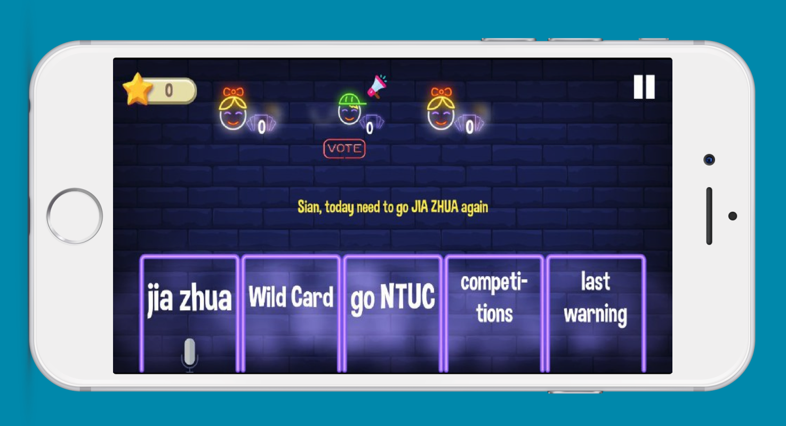

# hackomania2019-wanfightah
Hackathon entry for HackOMania 2019

### About
* This app was created for the problem statement of "How do we gamify the process of crowdsourcing to facilitate the collection of both Singlish speech and corresponding transcribed text data?"
* The app is an Android Real-time multiplayer card game
* This app won the **People's Choice Award** for the competition

### How the game works
* Game can be played with 2-8 players
* Each player will draw 5 cards at the start from the deck
* Game will be played in rounds. In each round, every player will choose a card from their hand that fits the question posed
* The aim is to pick a card (which consists of a phrase) from the hand that fits the question posed such that the response is funny
* Upon choosing a card for the current question, each player will proceed to record his/her voice and say out the entire sentence (hence the collection of Singlish speech and its corresponding transcribed text)
* Once a player has recorded his/her voice, other players will be notify of it in real-time. Players will proceed to listen to the voices of other players and vote for the one which has the funniest response
* Players who obtained votes from other player will get 1 point
* The game will repeat for 10 rounds, and the player with the highest score at the end wins
* Note: Each question and card drawn are Singlish (Singapore English) related. Wild card is a card that allows player to give anything as the answer and hence, the ability for us to collect even more variety of data

### How to use
* Change the `applicationId` in `build.gradle` to your desired `applicationId`
* Replace the `app_id` in `ids.xml` from your Google Play Console account. The `app_id` is used for Google Play Game Services.
* Create a firebase account and add replace the `google-services.json` file with a valid one. Firebase account is only used to store voices recorded by players so that other players can listen to them in real-time during gameplay. If you choose to store the voices recorded in other manner, you may skip this step.

### Note
* This app was created in 24 hours for the Hackathon Competition called HackOMania 2019 organised by GeeksHacking Community.
* As such, this app is not complete and not fully functional. Bugs may be present.
* Code was written quickly to meet the deadline, and coding standard may not be strictly adhered.
